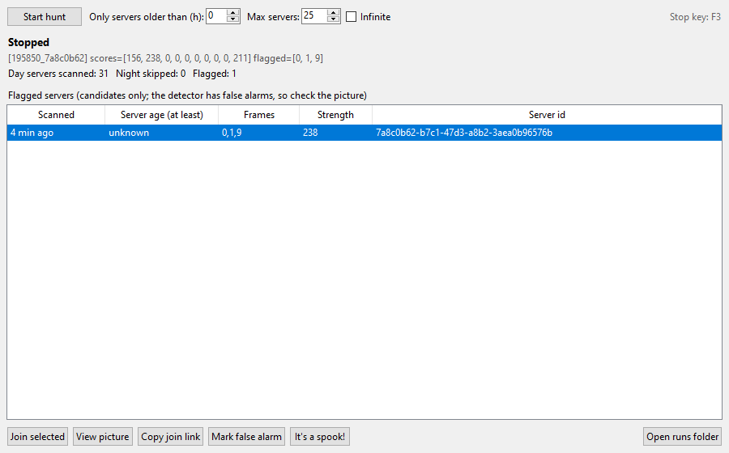
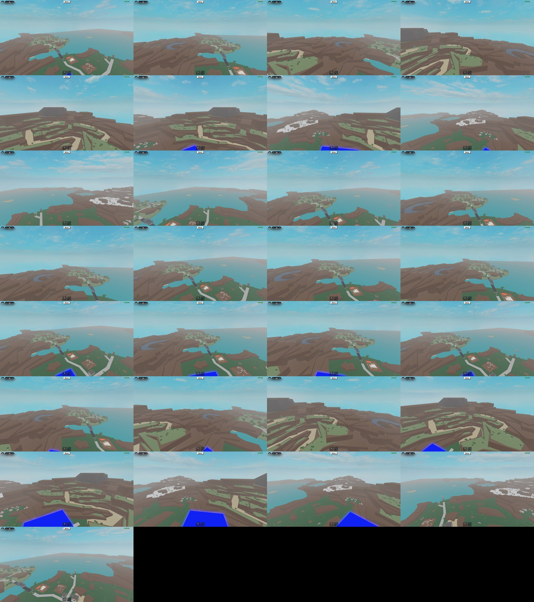
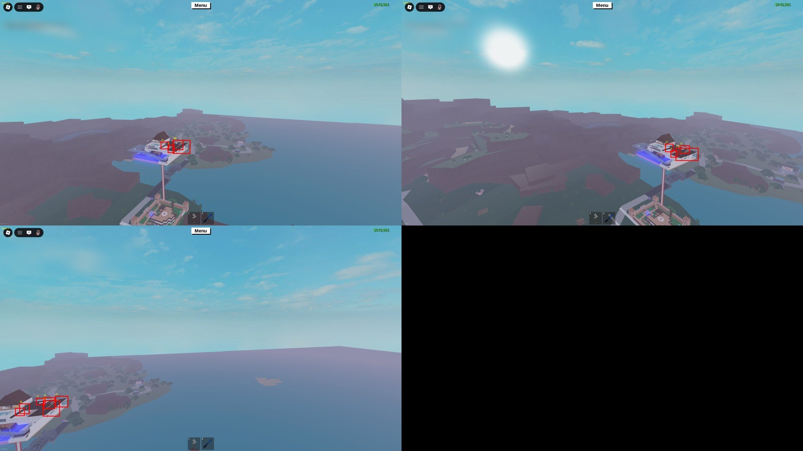

# LT2 Spook Hunter

**Let your PC server-hop Lumber Tycoon 2 for Spook trees while you do something else.**

Spook trees only grow in October, there are a couple per server at most, and finding one
normally means hours of joining servers, loading your base, and squinting at the horizon.
LT2 Spook Hunter does that loop for you on Windows: it joins a server, skips it if it's
night, loads your lookout base, photographs the whole map around it, looks for black bare
trees, and moves on. When it sees something it pops its window to the front, beeps, and
gives you a one-click **Join** button for that exact server.



> **Use at your own risk.** This is an input-automation tool (it moves the mouse and presses
> keys for you, like a macro). It does not inject into or modify Roblox, but automating
> gameplay may be against Roblox's Terms of Use. Not affiliated with Roblox or Defaultio.

## What it does, per server

1. **Picks a server.** Random public servers, or (with the optional age tracker) only
   servers that have been up long enough to have grown a Spook tree.
2. **Skips night.** Night and fog hide black trees, so night servers are skipped.
3. **Loads save slot 2** — your lookout base.
4. **Ground-level survey.** On the plot-select screen the camera orbits each plot; the
   hunter grabs frames of the first few plots, so it sees the ground near the plots.
5. **Tower sweep.** In first person on top of your base it levels the camera on the
   horizon and turns a full circle, then does a second circle tilted toward the ground.
6. **Detects** near-black, colourless shapes (Spook bark is black and the tree is bare) and
   saves every frame plus a contact sheet, flagged or not.
7. **Alerts you** in the control panel with a Join button, the server's age, and a picture
   with red boxes around what it found.

About 2 minutes per server, roughly 30 images each.



## Requirements

- Windows 10/11 and the Roblox desktop app.
- Python 3.10+ (python.org installer; tick "Add to PATH").
- Your **primary monitor** is 16:9 (1920×1080 tested) and Roblox runs maximized on it.
- An LT2 **save slot 2** base that spawns you **high up with a clear view** — a tall tower
  works best. The hunter loads slot 2 every server.

## Install

```
git clone https://github.com/tiiow-fedora/lt2-spook-hunter
cd lt2-spook-hunter
pip install -r requirements.txt
copy config.example.json config.json
```

Then double-click **`Start LT2 Spook Hunter.bat`**.

## Use

1. Open Roblox and join any Lumber Tycoon 2 server once (so Roblox is running).
2. In the panel, choose **Max servers** or tick **Infinite**, then press **Start hunt**.
3. Don't touch the mouse while it runs — it needs the Roblox window.
4. **Press F3 at any time to stop.** It lets go of every key and button first.

When a server is flagged:

- **View picture** — the flagged frames with red boxes on the suspects.
- **Join selected** — opens that exact server in Roblox.
- **Mark false alarm** — hides it and saves the crops to `data/dataset/false_alarm`.
- **It's a spook!** — saves it to `data/dataset/spook` (please share these — real examples
  are what improve the detector).

Every frame is kept in `data/runs/<time>_<server>/`; `sheet.jpg` in each folder shows a
whole server at a glance.

## Finding old servers (optional, recommended)

A new server can't have a Spook tree: the first sapling only appears after roughly
**6 hours of uptime**, and it takes about 3 more hours to grow. Fresh servers are a waste
of time. Roblox doesn't tell you a server's age, so
`tracker/lt2_tracker.py` polls the public server list every 10 minutes and remembers when
it first saw each server. After a few hours it knows which servers are old.

- **On this PC:** run `tracker\install_task_windows.bat` once. Keep
  `"tracker": {"file": "tracker/alive.json"}` in `config.json`.
- **On a always-on Linux box / NAS:** copy the `tracker` folder there, run
  `sh install_cron.sh`, and point `config.json` at it:
  `"tracker": {"ssh": ["ssh", "user@host"], "alive_path": "/path/to/tracker/alive.json"}`.

Then set **"Only servers older than (h)"** in the panel (6–9 is a good value once the
tracker has that much history). Ages are lower bounds: a server is *at least* that old.

## Settings

`config.json`:

| key | meaning |
| --- | --- |
| `data_dir` | where screenshots go (they add up — point it at a big drive) |
| `tracker` | where to read the age tracker's `alive.json` (see above) |
| `swamp_pass` | extra close-up pass aimed at the swamp; tuned for the author's tower, leave `false` |

Command-line options: `python lt2_hunt.py --help` (number of plots surveyed, tilt passes,
detection threshold, `--sweep-only` to test your camera setup, ...).

## How detection works

Daytime LT2 scenery is never pure black and colourless, but Spook bark is. The detector
downsizes each frame, masks the HUD, and looks for near-black neutral blobs (plus thin dark
branch-like features). Frames are also checked in quarters at double resolution so far-away
trees aren't lost. Expect some false alarms — dark pines on snow, shadows, players' builds —
and use **Mark false alarm** to keep your list clean.



## Troubleshooting

- **It clicks but nothing happens** — Roblox must be on the primary monitor and maximized.
- **"You may only load once every 60 seconds"** — normal; the hunter waits it out.
- **Leveling fails / sweeps look at the sky** — your base needs a clear horizon; test with
  `python lt2_hunt.py --sweep-only` while standing on it.
- **Server list errors (HTTP 429)** — Roblox rate-limits the list; with the tracker set up the
  hunter falls back to the tracker's list automatically.

## License

MIT
